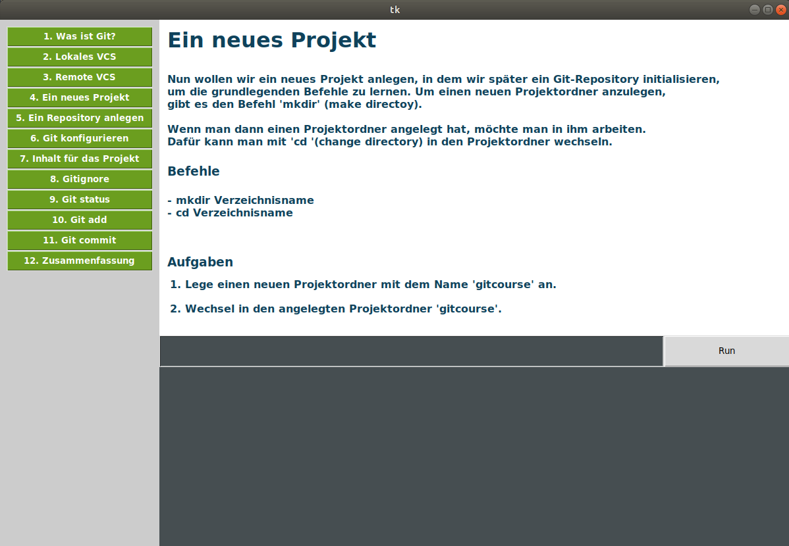
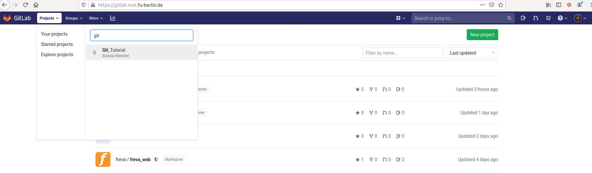
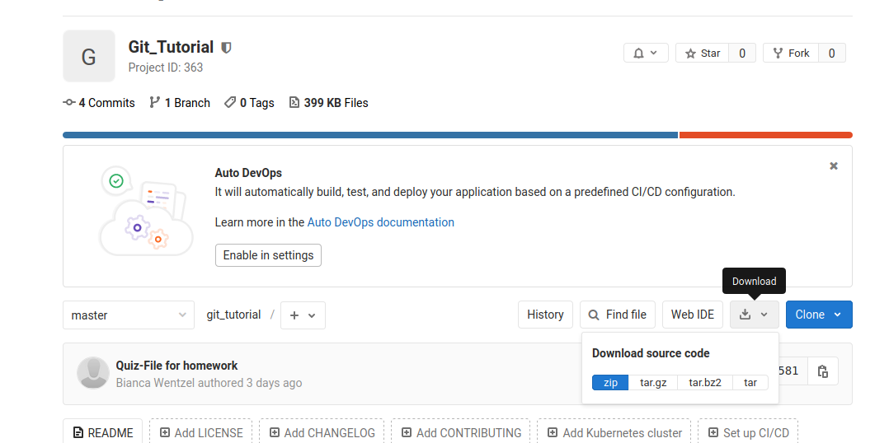

# Git Tutorial

## Überblick
Das Tutorial ist in 2 Teile aufgebaut:

##### 1. Basic commands
  * Was ist Git?
  * Struktur von Git
  * git init
  * Konfiguration
  * git status
  * git add
  * git commit
  
##### 2. Advanced commands
  * git diff
  * git log
  * git checkout
  * git reset
  * git push
  * git pull

## Anleitung zum Starten des Tutorials
### 1. Installiere Git:

   #### Linux:
   Führe einen der folgenden Befehle aus
      
       apt install git  (Ubuntu, Fedora ...)
       yum install git  (CentOS)
         
   #### MacOs:
   Führe den folgenden Befehl aus
      
        brew install git
         
   #### Windows:
      
   Downloade unter folgendem Link git und installiere es: https://gitforwindows.org/
       
       
### 2. Lade dir die Tutorialsoftware herunter:

Besuche die Gitlab-Seite des Instituts und logge dich mit deinem Institutsaccount an: https://gitlab.met.fu-berlin.de

Suche über den 'Projects'-Reiter nach dem Projekt 'Git_Tutorial'  

Lade die Projektresourcen herunter.

Verschiebe die heruntergeladenen Projektresourcen in einen Ordner deiner Wahl und entpacke sie.
  
         
### 3. Starte das Tutorial:

#### Linux und MacOs:
Öffne ein Terminal und navigiere zu dem Ort, an dem du die Software des Git-Tutorials gespeichert und entpackt hast.
Wechsel in den 'git_tutorial'-Ordner und führe den folgenden Befehl aus:

    python main.py
    
#### Windows:
Suche über die Apps nach der Power-Shell und öffne sie.
Navigiere nun zum Ort, an dem du die Software des Git-Tutorials gespeichert und entpackt hast.
Wechsle in den 'git_tutorial'-Ordner und führe den folgenden Befehl aus:

    python main.py
    
    